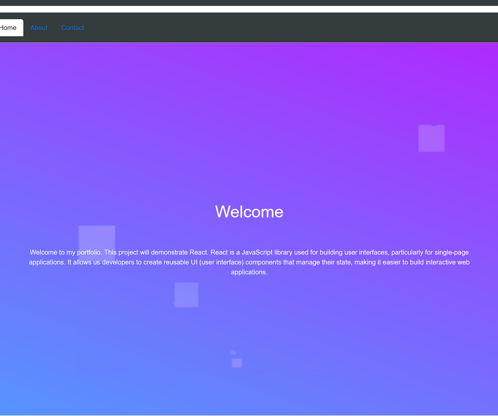
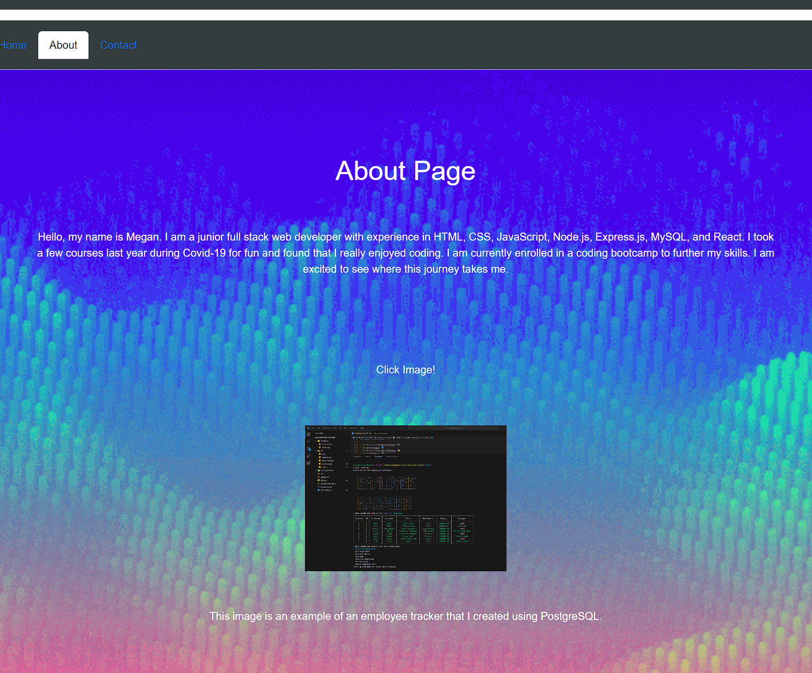
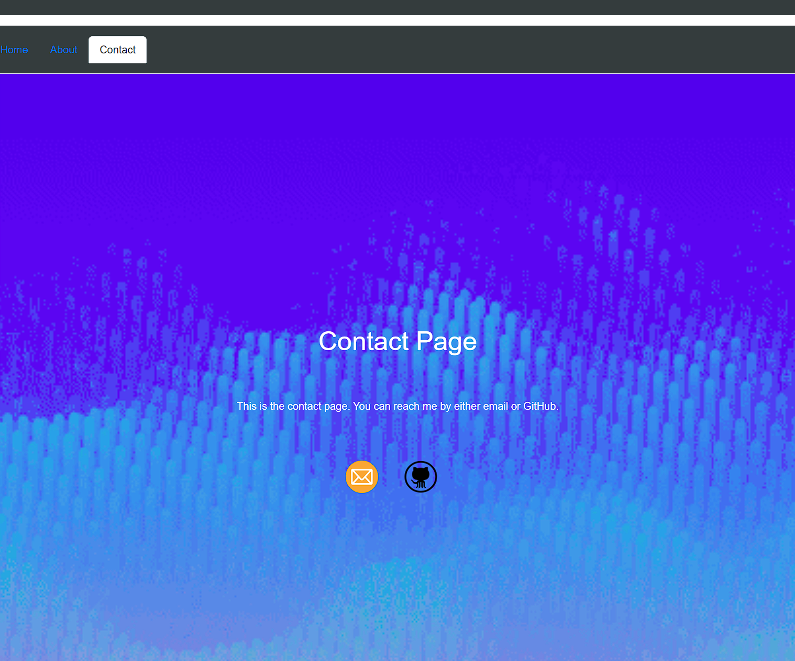

# React + Vite

This template provides a minimal setup to get React working in Vite with HMR and some ESLint rules.

Currently, two official plugins are available:

- [@vitejs/plugin-react](https://github.com/vitejs/vite-plugin-react/blob/main/packages/plugin-react/README.md) uses [Babel](https://babeljs.io/) for Fast Refresh
- [@vitejs/plugin-react-swc](https://github.com/vitejs/vite-plugin-react-swc) uses [SWC](https://swc.rs/) for Fast Refresh

## Description
This project was made to help bootcamp students display out skills, projects, and 
overall experiance with React.js. React features modern UI elements and responsive layouts that highlight our proficiency in front-end development.

## Installation

- npm install
- npm run dev

## Links
- GitHub: https://github.com/meg-an321/React-Portfolio
- Netlify: https://warm-lollipop-3a1192.netlify.app/
- Video: https://drive.google.com/file/d/1jo87L-DLF1PpFRHBAlIUIUEkN9PKVjOu/view?usp=sharing